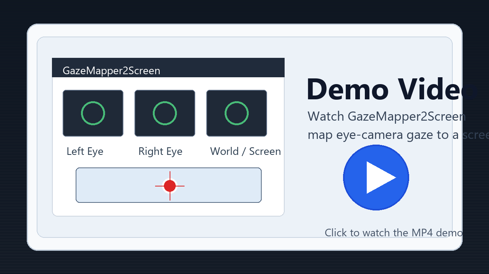
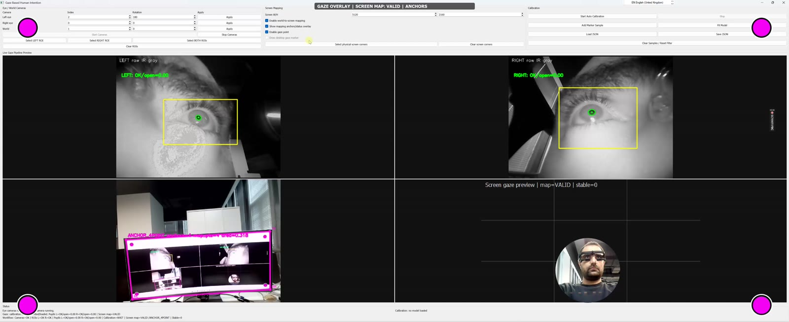
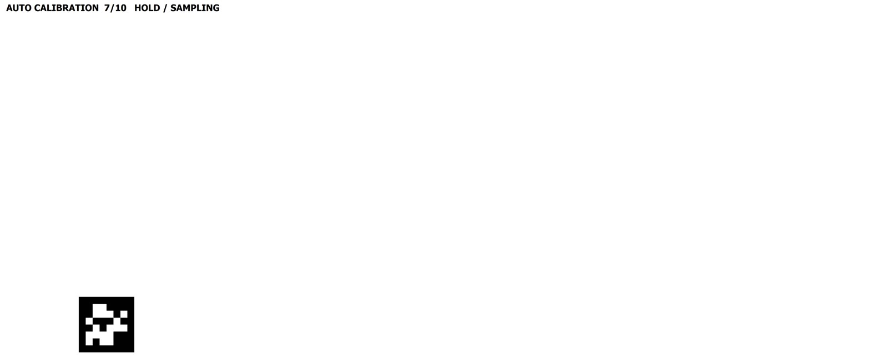
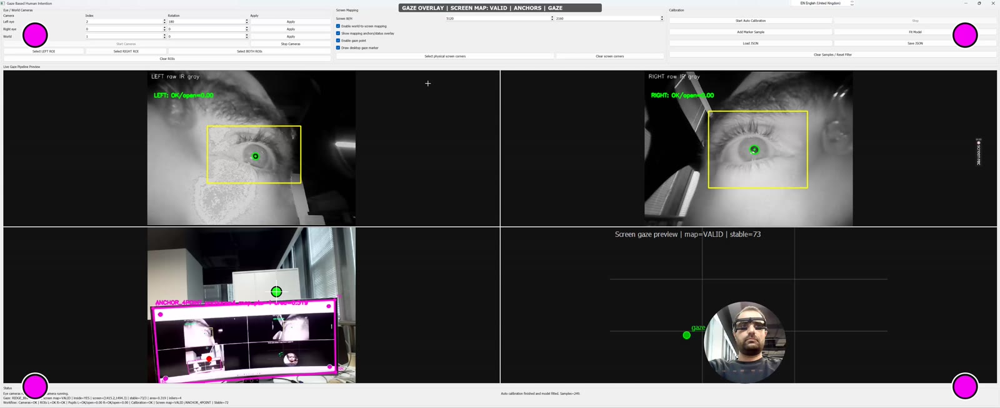

# GazeMapper2Screen

GazeMapper2Screen is a Windows desktop application for mapping gaze from two eye
cameras to a screen target.

## Download

Download the latest release asset:

- [GazeMapper2Screen-v1.0.0.exe](https://github.com/wael-taie/GazeMapper2Screen-Release/releases/download/v1.0.0/GazeMapper2Screen-v1.0.0.exe)

## Demo Video

[](https://github.com/wael-taie/GazeMapper2Screen-Release/releases/download/v1.0.0/gazemapper2screen.mp4)

[Watch or download the demo video](https://github.com/wael-taie/GazeMapper2Screen-Release/releases/download/v1.0.0/gazemapper2screen.mp4)

Both files are also available on the
[v1.0.0 release page](https://github.com/wael-taie/GazeMapper2Screen-Release/releases/tag/v1.0.0).

## Workflow Highlights

### ROI Selection And Pupil Detection



### Fullscreen Auto-Calibration Marker



### Screen Gaze Overlay



## Requirements

- Windows 10 or Windows 11, 64-bit
- PowerShell enabled
- Three Windows-visible cameras:
  - left eye camera
  - right eye camera
  - world/screen camera
- Camera drivers installed

## Run

Double-click `GazeMapper2Screen-v1.0.0.exe`.

The app extracts its runtime files automatically under:

```text
%LOCALAPPDATA%\GazeMapper2Screen
```

No separate Qt, OpenCV, Visual Studio, or CMake installation is required for
normal use.

## Notes

Some antivirus products may warn about self-extracting executables, especially
when the file is unsigned. For wider distribution, code-signing the release file
is recommended.
